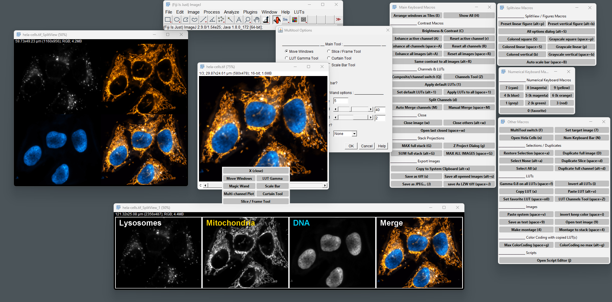

# Visualization Toolset

This toolset is a collection of macros designed to make routine manipulation in ImageJ fast and convenient

* __Installation :__
	- in Fiji, add the Visualization Toolset [Update Site](https://imagej.net/update-sites/following)
	- For ImageJ, download this repository as .zip from the last release, place the Visualization_toolset.ijm file and the icons folder in the toolset directory of your ImageJ or Fiji application. (ImageJ/macros/toolsets)     
	- You will now find the toolset in the "More Tools" menu of imageJ main window ( [>>] button ).     

This Toolset requires to activate the __IBMP-CNRS__ (for Action Bars) and __BioVoxxel Toolbox__ [Update Sites](https://imagej.net/update-sites/following) and an ImageJ version ≥ 1.53t

You can find documentation in [This website](https://kwolby.notion.site/kwolby/Visualization-Toolset-4e0a4f2834494ba5a4865a99c6913323)

Thanks for trying out this toolset and please provide feedback, share your thoughts on how the toolset can be improved or expanded!

